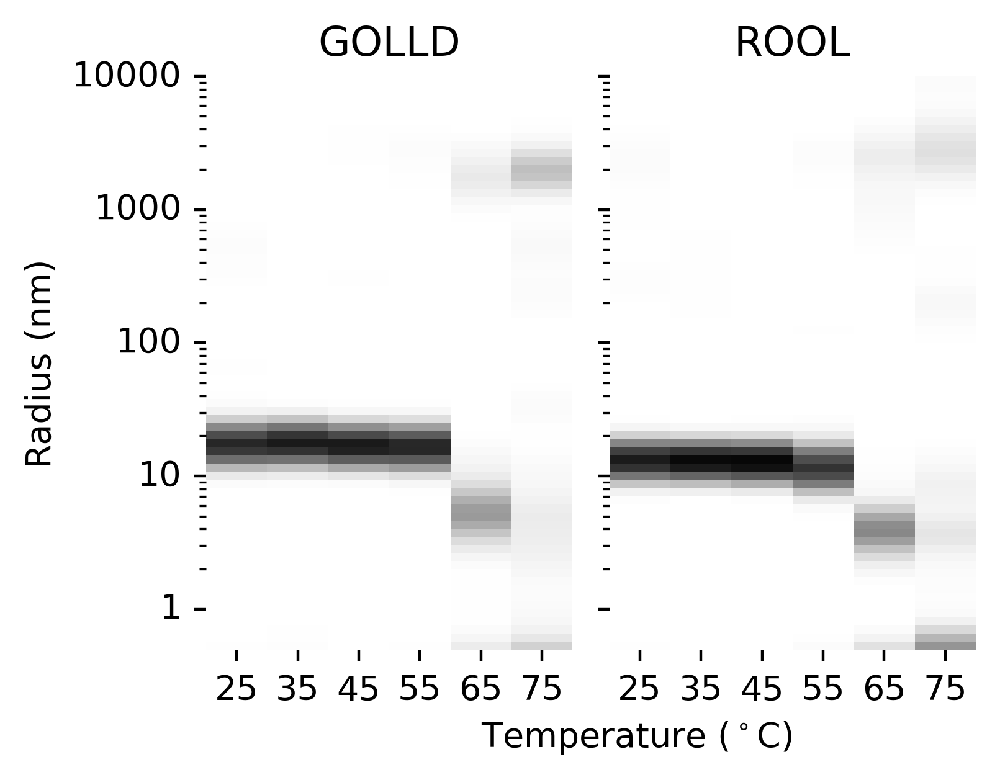

# RNA_multimer_2024
Scripts accompanying publication of RNA multimer structures. __TODO insert publication__

### Biochemical data and plotting

#### Mass photometry (mass)

#### Dynamic light scattering (hydrodynamic radius)
Dynamic light scattering data and plotting can be found in [biochemical_analysis/dynamic_light_scattering/](biochemical_analysis/dynamic_light_scattering/).

#### Bioanlyizer traces (purity)

