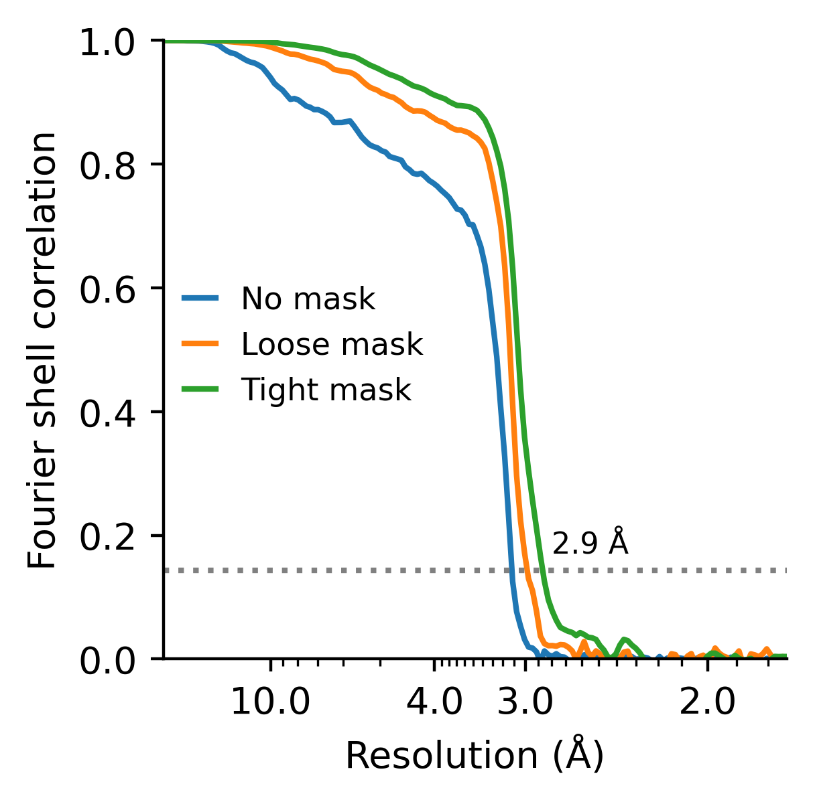

# Ornate RNA Structures 2024
Scripts accompanying publication of ornate RNA structures:

Kretsch, Rachael C., Yuan Wu, Svetlana A. Shabalina, Hyunbin Lee, Grace P. Nye, Eugene V. Koonin, Alex Gao, Wah Chiu, and Rhiju Das. 2024. “Naturally Ornate RNA-Only Complexes Revealed by Cryo-EM.” bioRxiv. https://doi.org/10.1101/2024.12.08.627333.

### Biochemical data and plotting
Source tables for the manuscript are found source_tables_for_supplement [biochemical_analysis/source_tables_for_supplement/](biochemical_analysis/source_tables_for_supplement/) created by [biochemical_analysis/get_source_tables.ipynb](biochemical_analysis/get_source_tables.ipynb).

#### Mass photometry (mass)

Mass photometry data and plotting can be found in [biochemical_analysis/mass_photometry/](biochemical_analysis/mass_photometry/). For example: 

#### Dynamic light scattering (hydrodynamic radius)
Dynamic light scattering data and plotting can be found in [biochemical_analysis/dynamic_light_scattering/](biochemical_analysis/dynamic_light_scattering/). For example: 

#### Bioanalyzer traces (purity)

Bioanalyzer data and plotting can be found in [biochemical_analysis/bioanalyzer/](biochemical_analysis/bioanalyzer/).
    

### Cryo-EM data and plotting

#### Data availability

Cryo-EM micrographs, particle stacks, maps, and models can be found in their respectively repository with the following ascension codes:

(we will link the data as it becomes publicly available)

| Molecule       | EMPIAR | EMDB  | PDB  |
| -------------- | ------ | ----- | ---- |
| raiA           | 12706  | 48162 | 9ELY |
| OLE (dimer)    | 12707  | 48163 | 9MCW |
| ROOL (8-mer)   | 12708  | 48179 | 9MDS |
| GOLLD (14-mer) | 12709  | 48214 | 9MEE |

### FSC, B-factor, and Q-score plots

The plots descirbing the quality of the cryo-EM data and model can be found in [cryoEM_analysis/plot_fsc.ipynb](cryoEM_analysis/plot_fsc.ipynb), [cryoEM_analysis/Bfactor-plot.ipynb](cryoEM_analysis/Bfactor-plot.ipynb), and [cryoEM_analysis/plot-Qscores.ipynb](cryoEM_analysis/plot-Qscores.ipynb). For example:
   

